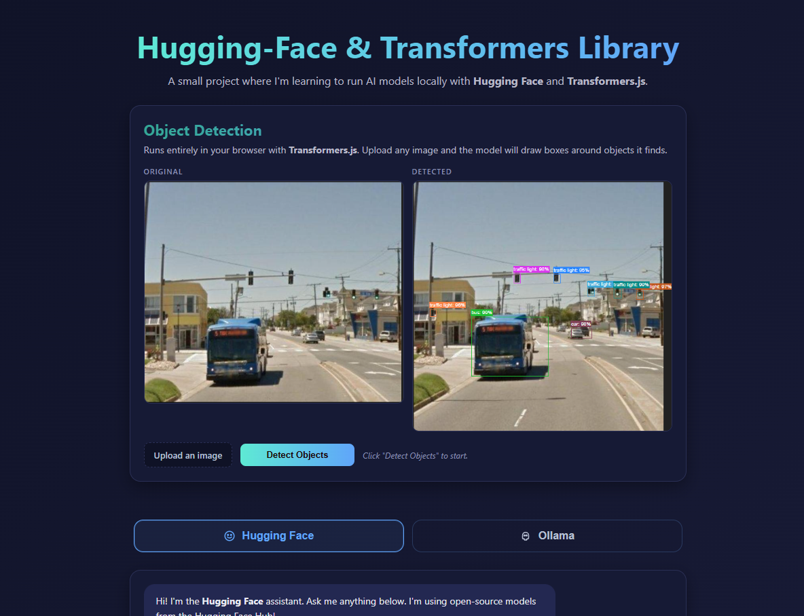

# Transformers · Hugging Face · Ollama — Learning Project



A small learning project where I'm exploring how to use **open-source AI models** in three different ways:

1. **Hugging Face Inference API** — call hosted open-source models from the backend.
2. **Transformers.js** — run open-source models **directly in the browser** (no server needed).
3. **Ollama** — run open-source models **locally on my own PC**.

The frontend is a single page with a chat box (Hugging Face / Ollama tabs) and an Object Detection demo that runs fully client-side with Transformers.js.

> Repo: [tarekmonowar/Transformers-HuggingFace-Ai](https://github.com/tarekmonowar/Transformers-HuggingFace-Ai)

---

## What I'm Learning

- How to stream chat completions from the **Hugging Face Inference API** using `@huggingface/inference`.
- How to call a **local Ollama server** (`http://localhost:11434/api/chat`) and stream tokens back to the browser.
- How to run a **Transformers.js** model (`Xenova/yolos-tiny` for object detection) fully in the browser — no backend inference required.
- How to wire all of this into a clean **Express + TypeScript** backend with separate routers, controllers, and services.

---

## Tech Stack

- **Backend:** Node.js, Express 5, TypeScript, `ts-node`
- **AI / Models:**
  - `@huggingface/inference` (Hugging Face Inference API)
  - Ollama REST API (local, `llama3.2` by default)
  - `@xenova/transformers` (Transformers.js, browser-side)
- **Frontend:** Vanilla HTML / CSS / JS (ES modules), streaming via `fetch` + `ReadableStream`

---

## Project Structure

```
Ai-Hugging-face/
├── app.ts                      # Express app + route mounting
├── server.ts                   # Server bootstrap
├── config/
│   └── env.ts                  # Env config (PORT, HF_TOKEN, OLLAMA_BASE_URL, ...)
├── HuggingFace/
│   ├── hugging.router.ts       # POST /api/huggingface/chat
│   ├── hugging.controller.ts   # Streams tokens to the client
│   └── hugging.services.ts     # Calls @huggingface/inference (chatCompletionStream)
├── ollama/
│   ├── ollama.router.ts        # POST /api/ollama/chat
│   ├── ollama.controller.ts    # Streams tokens to the client
│   └── ollama.services.ts      # Calls local Ollama /api/chat
└── public/
    ├── index.html              # UI: tabs + chat + object detection card
    ├── index.js                # Chat UI logic (Hugging Face / Ollama tabs)
    ├── transformer.js          # Browser-side object detection (Transformers.js)
    ├── utils/
    │   ├── stream.js           # fetch-based streaming reader
    │   └── ui.js               # DOM helpers (bubbles, typing dots, etc.)
    └── images/
        ├── orginalimage.png
        ├── outputImage.png
        └── pic.png
```

---

## Getting Started

### 1. Clone and install

```bash
git clone https://github.com/tarekmonowar/Transformers-HuggingFace-Ai.git
cd Transformers-HuggingFace-Ai
npm install
```

### 2. Set up environment variables

Create a `.env` file in the project root:

```env
PORT=9000

# Hugging Face
HF_TOKEN=hf_your_token_here
HF_MODEL=google/gemma-2-2b-it

# Ollama
OLLAMA_BASE_URL=http://localhost:11434
OLLAMA_MODEL=llama3.2
```

- Get an `HF_TOKEN` from [Hugging Face → Settings → Access Tokens](https://huggingface.co/settings/tokens).
- For Ollama, install the [Ollama desktop app](https://ollama.com/) and pull a model:
  ```bash
  ollama pull llama3.2
  ```

### 3. Run in dev

```bash
npm run dev
```

Open <http://localhost:9000>.

### 4. Build & start

```bash
npm run build
npm start
```

---

## API Endpoints

Both endpoints accept `POST` with a JSON body `{ "message": "your prompt" }` and respond with a streaming `text/plain` token stream.

| Method | Endpoint                  | Powered by                  |
| ------ | ------------------------- | --------------------------- |
| POST   | `/api/huggingface/chat`   | Hugging Face Inference API  |
| POST   | `/api/ollama/chat`        | Local Ollama server         |

Example:

```bash
curl -N -X POST http://localhost:9000/api/huggingface/chat \
  -H "Content-Type: application/json" \
  -d '{"message":"Explain transformers in one sentence."}'
```

---

## Object Detection (Transformers.js, in-browser)

The Object Detection card on the home page loads `Xenova/yolos-tiny` directly in the browser via `@xenova/transformers` — no backend call is made for inference. Upload an image, click **Detect Objects**, and bounding boxes are drawn over the detected objects.

This is the part of the project where I learned that you can run real ML models client-side, with zero server cost.

---

## Notes

- This is a **personal learning project**, not a production app.
- Streaming on the server uses `res.write(token)` with `Content-Type: text/plain` and `X-Accel-Buffering: no` so chunks reach the browser immediately.
- `AbortController` on the client allows stopping a streaming response mid-flight (the **Stop** button).

---

## License

ISC — free to use for learning.
